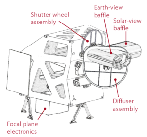

```{r xaringan-themer, include=FALSE, warning=FALSE}
library(xaringanthemer)
style_mono_accent(base_color = "#43418A")
```


# What is OLI-2?
### Operational Land Imager 2 

.pull-left[
- A remote sensing instrument aboard **Landsat 9**

- A copy of **Landsat 8’s OLI**

- It captures observations of the Earth’s surface in visible, near-infrared, and shortwave-infrared bands.

- It collects data in 15-m panchromatic and 30-m multispectral spatial resolutions over a 14-bit dynamic range.
]

.pull-right[
```{r echo=FALSE,out.width='70%'}

```

.small[Diagram of OLI-2. Source:[NASA](https://landsat.gsfc.nasa.gov/satellites/landsat-9/landsat-9-instruments/oli-2-design/)
]]

---
#Application 1
### According to 9 spectral bands OLI-2 provides, it has various applications.

#### Environmental monitoring of the coastal zone:
- Band 1 **Coastal/Aerosol** (0.43 - 0.45 µm) 30-m

#### Ground Objects Identification of True Color Images:
- Band 2 **Blue** (0.450 - 0.51 µm) 30-m
- Band 3 **Green** (0.53 - 0.59 µm) 30-m
- Band 4 **Red** (0.64 - 0.67 µm) 30-m
---
#Application 2

#### Vegetation Information Extraction：
- Band 5 **Near-Infrared** (0.85 - 0.88 µm) 30-m

#### Drought Monitoring, Fire Monitoring and Minearal Informtion Extraction:
* Band 6 **SWIR 1** (1.57 - 1.65 µm) 30-m
* Band 7 **SWIR 2** (2.11 - 2.29 µm) 30-m

#### Ground Objects Identification and Data Fusion
* Band 8 **Panchromatic(PAN)** (0.50 - 0.68 µm) 15-m

#### Cirrus Detection and Data Quality Evaluation
* Band 9 **Cirrus** (1.36 - 1.38 µm) 30-m
---
#Reflection

### Higher radiometric resolution

- **14-bit** quantization increased from 12-bits for Landsat 8 

- Allowing sensors to detect **more subtle differences**, especially over **darker areas** such as water or dense forests.

### Both internal calibration sources 

- Ensure **radiometric accuracy and stability**, as well as the ability to perform **solar and lunar calibrations**.


