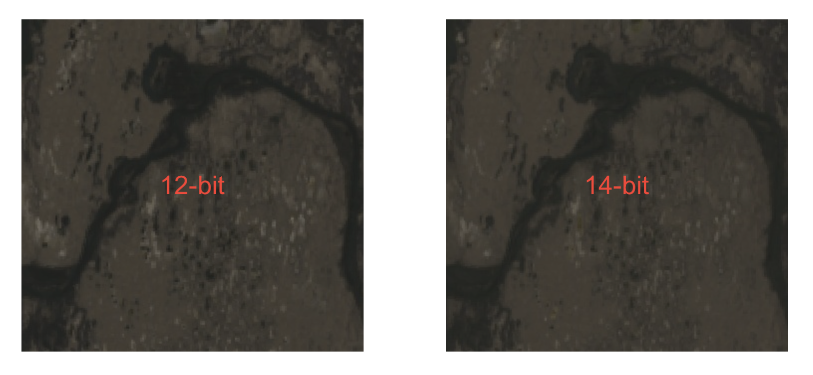
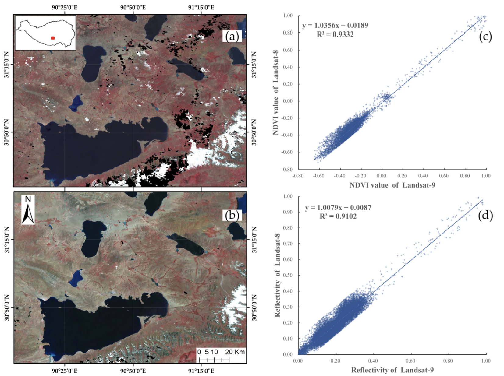
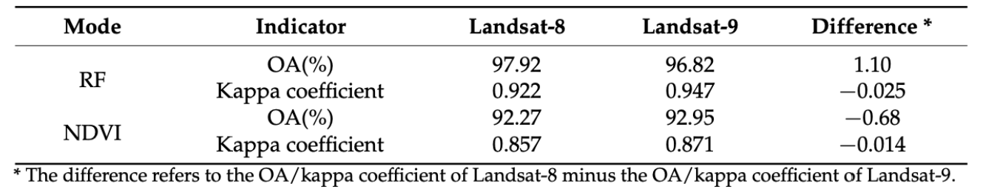
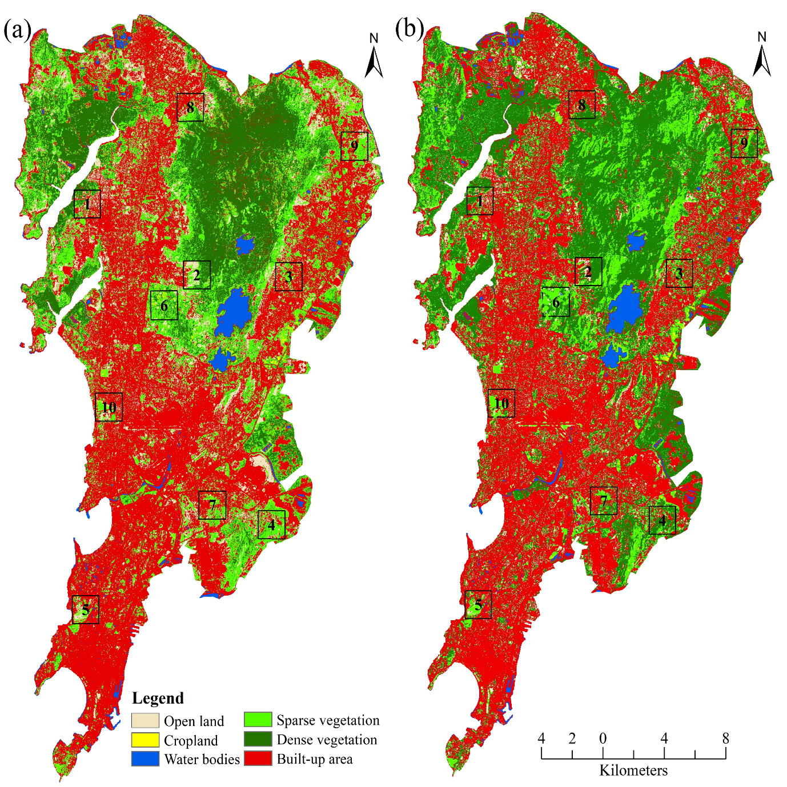
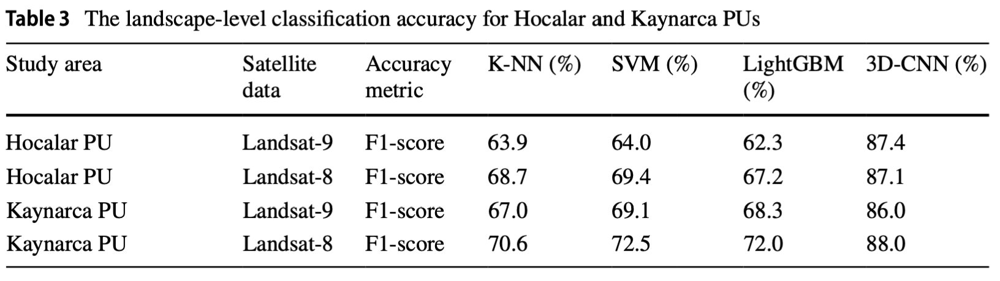

```{r xaringan-themer, include=FALSE, warning=FALSE}
library(xaringanthemer)
style_mono_accent(base_color = "#43418A")
```


## What is OLI-2?
### Operational Land Imager 2 
.pull-left[
- A remote sensing instrument aboard **Landsat 9**, **a copy of OLI** in Landsat 8.

- It captures observations of the Earth’s surface in **visible, near-infrared, and shortwave-infrared bands**.

- It collects data in 15-m panchromatic and 30-m multispectral spatial resolutions over a 14-bit dynamic range.
]

.pull-right[
```{r echo=FALSE}
knitr::include_graphics('img/OLI-2-sketch.png')
```

.small[Diagram of OLI-2. Source:[NASA](https://landsat.gsfc.nasa.gov/satellites/landsat-9/landsat-9-instruments/oli-2-design/)
]]
---
## Improvements 1
#### Higher radiometric resolution
OLI-2's 14-bit radiometric resolution enables to detect more subtle differences, especially over darker areas such as water or dense forests. 
* 14 bit = 16,384 shades
* 12 bit = 4,096 shades
```{r echo=FALSE,out.width='80%', fig.align='center'}

```
.small[
Source: [USGS](https://earthexplorer.usgs.gov/)
]
---
## Improvement 2
#### Spectral Characterization
- Goddard Laser for Absolute Measurement of Radiance (**GLAMR**), replaced the traditional monochromator based approach
- **In-band and out-of-band spectral response characterization** of all OLI-2 detectors at the integrated instrument level, versus about 15% of the detectors in-band only for OLI. 

#### Non-linearity Characterization
- **20 in-band radiance-controlled radiance levels** were measured for all 9 OIL-2 bands

#### Spatial Characterization
- A **continuous** scanning approach

---
## Application - Water Body Extraction
### Lake Area Extraction in  Qinghai Tibet Plateau
```{r echo=FALSE, out.width='60%', fig.align='center'}

```
.small[Image acquisition and linear regression. (a) Landsat-8 image; (b) Landsat-9 image; (c) linear regression of NDVI; and (d) linear regression of reflectance.
Source:[Li et al., 2022](https://www.mdpi.com/2072-4292/14/18/4612)
]
---
## Application - Water Body Extraction

#### Comparison of the overall accuracy of water extraction of Landsat-8 and Landsat-9
```{r echo=FALSE, fig.align='center'}

```
- Landsat-9, similar to Landsat-8, can recognize plateau 
waterbodies well. 

- Although the radiometric resolution of Landsat-9 is improved to 14 bits, it has **no apparent advantage** in relatively simple tasks, such as waterbody recognition.
---
### Application 2 - Land use Land Cover Classification
**OLI-2's Performance for LULC classification is uncertain**
```{r xaringan-panelset, echo=FALSE}
xaringanExtra::use_panelset()
```
.panelset[
.panel[.panel-name[Better Performance]
- More accurate in distinguishing dense and sparse vegetation as well as darker and lighter objects(Shahfahad et al., 2022).
- Better determined in artificial surfaces(Ghasempour, Sekertekin and Kutoglu, 2023).
```{r echo=FALSE, out.width='35%',fig.align='center'}

```
.small[Classified LULC maps using multispectral bands of (a)OLI and (b)OLI-2. Source:[Shahfahad et al., 2022](https://www.tandfonline.com/doi/full/10.1080/10106049.2022.2152496?scroll=top&needAccess=true&role=tab)]
]

.panel[.panel-name[No Better Performance]
- OLI and OLI-2 both perform well in agriculture- and forest-dominated landscapes.
```{r echo=FALSE, fig.align='center'}

```
.small[Source: Saralioglu and Vatandaslar, 2022]
]
]
---
##Reflection


---
##Reference
.small[
Ghasempour, F., Sekertekin, A. and Kutoglu, S.H., 2023. How Landsat 9 IS Superior to Landsat 8: Comparative Assessment of Land Use Land Cover Classification and Land Surface Temperature. ISPRS Annals of Photogrammetry, Remote Sensing and Spatial Information Sciences, 14W1, pp.221–227.

Li, X., Zhang, D., Jiang, C., Zhao, Y., Li, H., Lu, D., Qin, K., Chen, D., Liu, Y., Sun, Y. and Liu, S., 2022. Comparison of Lake Area Extraction Algorithms in Qinghai Tibet Plateau Leveraging Google Earth Engine and Landsat-9 Data. Remote Sensing, 14(18), p.4612.

Lulla, K., Nellis, M.D., Rundquist, B., Srivastava, P.K. and Szabo, S., 2021. Mission to earth: LANDSAT 9 will continue to view the world. Geocarto International, 36(20), pp.2261–2263. 

Masek, J.G., Wulder, M.A., Markham, B., McCorkel, J., Crawford, C.J., Storey, J. and Jenstrom, D.T., 2020. Landsat 9: Empowering open science and applications through continuity. Remote Sensing of Environment, 248, p.111968. 

Saralioglu, E. and Vatandaslar, C., 2022. Land use/land cover classification with Landsat-8 and Landsat-9 satellite images: a comparative analysis between forest- and agriculture-dominated landscapes using different machine learning methods. Acta Geodaetica et Geophysica, 57(4), pp.695–716. 

Shahfahad, Talukdar, S., Naikoo, M.W., Rahman, A., Gagnon, A.S., Islam, A.R.M.T. and Mosavi, A., 2022. Comparative Evaluation of Operational Land Imager sensor on board Landsat 8 and Landsat 9 for Land use Land Cover Mapping over a Heterogeneou Landscape. Geocarto International, 0(ja), pp.1–21. 

]


